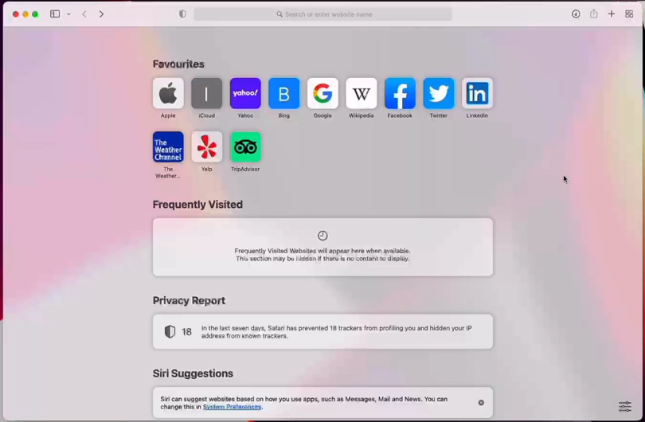

Apple Pay Web Demo
------------------

How to run:

* You must have Ruby 2.7.5 installed, along with Bundler.
* This interaction also requires TLS - you can setup a TLS tunnel using a service like ngrok to support this
* Your test device must be an Apple device with Touch ID, and you must be signed in to the Apple Sandbox, and have a test card registered (https://developer.apple.com/apple-pay/sandbox-testing/ - see Create a Sandbox Tester Account)

1. Run bundler and then start the server:

```
$ bundle
$ bundle exec ruby demo.rb
```

2. Run ngrok to get a URL:

```
$ ngrok http 4567
```

The ngrok command will provide a HTTP URL - grab this for the next step

3. Ensure the domain is registered:

```
$ curl https://gateway.pmnts-sandbox.io/v1.0/utilities/apple_pay/domains/the.domain.from.step.2.ngrok.io -u TEST:TEST
```
Once successful, go to Step 4

4. On your test device, open Safari and goto the URL from step 2
5. Click the Buy with Apple Pay button
6. If everything works properly you should see an alert stating 'Payment Successful. Transaction ID: XXXX-P-ZZZZZZZZZZZZ'

Demo
----



